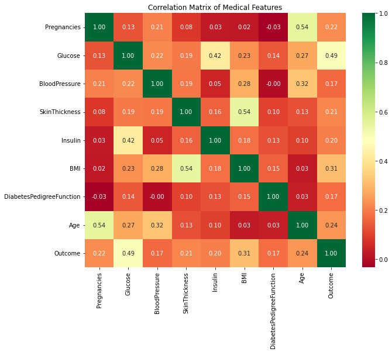
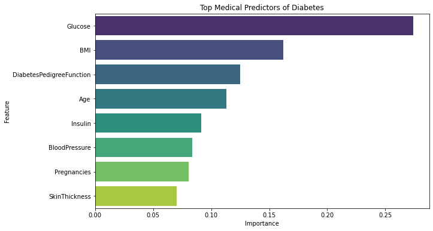
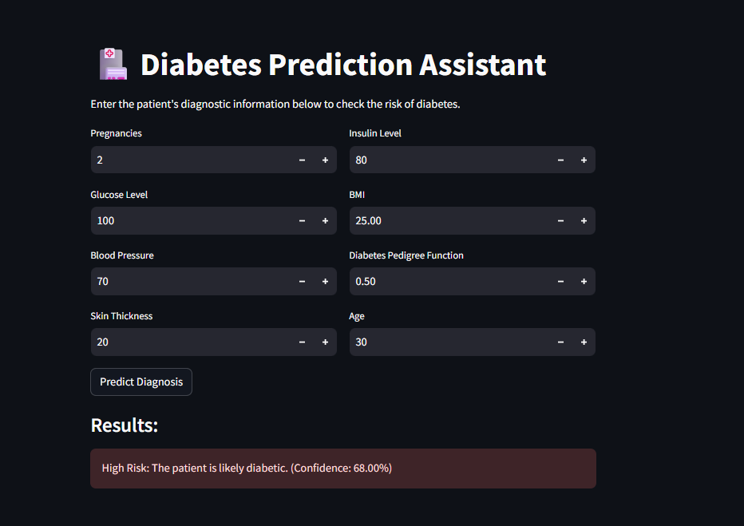

# 🏥 Diabetes Prediction Assistant: End-to-End ML Pipeline

## 📌 Project Overview
This project demonstrates a complete machine learning lifecycle, from raw data processing to a functional web application. I utilized the Pima Indians Diabetes dataset to build a **Random Forest Classifier** that predicts diabetes risk with **78% accuracy**.

The core value of this project lies in its **clinical data cleaning** and **deployment-ready architecture**.

## 🛠️ Tech Stack
* **Modeling:** Python, Scikit-Learn (Random Forest)
* **App Framework:** Streamlit
* **Data Analysis:** Pandas, NumPy
* **Visualization:** Seaborn, Matplotlib

## 🔍 Data Engineering & Cleaning
A critical part of this project involved handling **"Impossible Zeros."** In this dataset, values of 0 for medical metrics like Glucose and BMI actually represented missing data.
* **Detection:** Identified 0 values in Glucose, Blood Pressure, BMI, Skin Thickness, and Insulin.
* **Imputation:** Replaced zeros with `NaN` and imputed values using the **Median** of each feature to maintain data distribution.
* **Preprocessing:** Applied `StandardScaler` to ensure all features were normalized for the model.

## 📊 Visual Insights (EDA)

### 1. Feature Correlation
The correlation matrix revealed that **Glucose** and **BMI** are the most significant indicators for diabetes onset.

### 2. Model Decision Drivers
The Random Forest model identified the top predictors, confirming that clinical indicators like **Glucose** carry the most weight in the diagnostic prediction.

## 🚀 Interactive Web Application
I developed a **Streamlit** application that serves as a diagnostic assistant. It allows users to input diagnostic measurements and receive a prediction instantly.

### App Features:
* **Dynamic Inputs:** Real-time processing of 8 medical features.
* **Probability Scoring:** Provides a confidence percentage for each diagnosis (e.g., 68.00% confidence) to assist clinical decision-making.
* **Scalable Backend:** Uses exported `.pkl` files for the model and scaler to ensure consistency between training and deployment.
---
